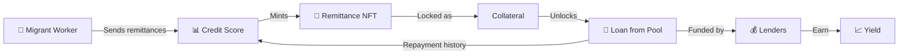
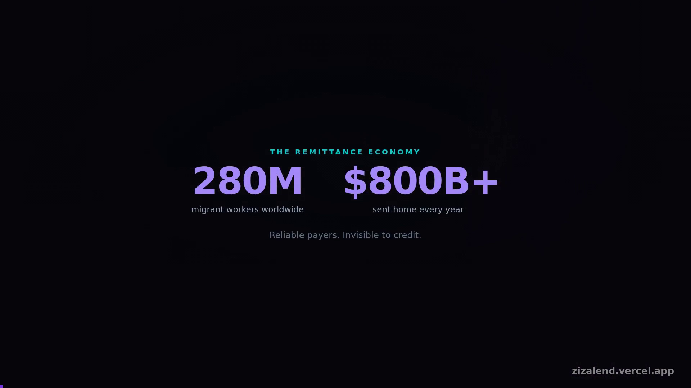
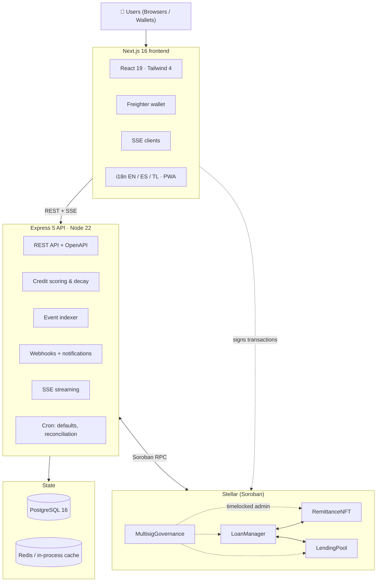

<div align="center">
  

  <h3><strong>Every transfer builds your future</strong></h3>

  <p>Portable, verifiable credit for people the banking system never scored.</p>

  <!-- CI / Quality Gates + License -->

<a href="https://github.com/Ziza-Inc/ZizaLend/actions/workflows/ci.yml"></a>
<a href="https://github.com/Ziza-Inc/ZizaLend/actions/workflows/codeql.yml"></a>
<a href="https://github.com/Ziza-Inc/ZizaLend/actions/workflows/deploy-staging.yml"></a>
<a href="https://github.com/Ziza-Inc/ZizaLend/actions/workflows/commitlint.yml"></a>
<a href="https://github.com/Ziza-Inc/ZizaLend/issues"></a>
<a href="https://github.com/Ziza-Inc/ZizaLend/graphs/contributors"></a>
<a href="LICENSE"></a>

  <!-- Deployment + verification -->
  <br/>
  <a href="https://zizalend.vercel.app"></a>
  <a href="docs/deployed-contracts.md"></a>
  
  <a href="docs/GAS.md"></a>
  <a href="https://codecov.io/gh/Ziza-Inc/ZizaLend"></a>
  
  
  
  <a href="docs/contracts-ACCESS-CONTROL.md"></a>
  <a href="https://youtu.be/2ZST7YiZ1Uk"></a>

  <!-- Tech Stack (versions verified against package.json / Cargo.toml / CI) -->
  <br/>
  
  
  
  
  
  
  
  
  
  
  
  

<br/><br/>
<strong><a href="#-overview">Overview</a> • <a href="#-live-on-testnet">Testnet</a> • <a href="#-pitch-video">Video</a> • <a href="ARCHITECTURE.md">Architecture</a> • <a href="docs/DEVELOPMENT.md">Development</a> • <a href="docs/TESTING.md">Testing</a> • <a href="docs/glossary.md">Glossary</a> • <a href="docs/wiki/README.md">Wiki</a> • <a href="CONTRIBUTING.md">Contributing</a> • <a href="SECURITY.md">Security</a> • <a href="ROADMAP.md">Roadmap</a></strong>
</div>

---

## 📑 Table of Contents

- [Overview](#-overview)
- [Live on Testnet](#-live-on-testnet)
- [Pitch Video](#-pitch-video)
- [Key Features](#-key-features)
- [System Architecture](#-system-architecture)
  - [Smart Contracts](#-smart-contracts)
  - [Backend Services](#-backend-services)
  - [Frontend](#-frontend)
  - [TypeScript SDK](#-typescript-sdk)
  - [Stellar Integration](#-stellar-integration)
- [Performance & Gas](#-performance--gas)
- [Tech Stack](#-tech-stack)
- [Quick Start](#-quick-start)
- [Configuration](#-configuration)
- [API](#-api)
- [Testing](#-testing)
- [Security](#-security)
- [Operations & Monitoring](#-operations--monitoring)
- [CI/CD & Deployment](#-cicd--deployment)
- [Documentation](#-documentation)
- [Contributing](#-contributing)
- [Project Structure](#-project-structure)
- [Project Stats](#-project-stats)
- [Roadmap](#-roadmap)
- [License](#-license)

---

## 🌍 Overview

**ZizaLend turns remittance history into portable credit.** Around 280 million migrant workers send money home every month, and traditional finance scores none of it. The transfer is the proof of reliability; the credit bureau never sees it. ZizaLend captures that proof on the Stellar blockchain, turns it into a verifiable on-chain credit identity, and opens access to fair, collateralized loans — no bureau, no branch visit, no discrimination based on where you were born.

Borrowers build a score (300–850) from real repayment behaviour and mint a **Remittance NFT** that carries it between applications and platforms. Lenders supply liquidity to transparent on-chain pools and earn yield backed by that same repayment history rather than by an underwriter's guess.



> 💡 **Why Stellar?** Sub-second finality, fees under a cent, a native asset that needs no bridge, and a Soroban runtime capable of expressing the whole loan lifecycle in four auditable contracts. For remittance corridors — where a $200 transfer can otherwise lose 6% to fees — the cost profile is not a detail, it is the product.

**What makes this infrastructure rather than a demo:** four deployed and mutually wired contracts, a typed API with a generated OpenAPI spec and SDK, an event-sourced indexer that keeps off-chain state honest, 1,110 automated tests behind 13 required status checks, measured gas costs, and 120 open issues already specced for contributors.

---

## 🌐 Live on Testnet

**Application:** <https://zizalend.vercel.app> — the production frontend, built against the contracts below. Connect a Freighter wallet on Testnet to use it.

All four contracts are deployed to Stellar Testnet, initialised, wired to each other, and verified by an end-to-end test that runs the real user journey against the live addresses.

| Contract | Address |
|---|---|
| `remittance_nft` | `CA7XGN4FUHQAEJMYQVOWJE6J4P75QWEQSTW3L6X2HRGILQAHKKRBHZQ2` |
| `lending_pool` | `CBOMMNN4L62O64ZZP2HYGURSJNPY3CDYR6DAIG342PSST3V6XSCOE3UJ` |
| `loan_manager` | `CDMZDO7YLWX7B6BXP5IJP6B5BRTLGSVQIRX3NLXU44GKFOYSPCZ5ER4F` |
| governance (LoanManager / LendingPool / RemittanceNFT) | `CCME5YVLAAPKJDVINV6AIN7JLZBIWMUIQPH5FKYRW7OFXBLDZLCEYGXL` / `CB5NXI2DY6JUEV7APIX6E5OKA3D5NXUCX6Q7CN4BPV3MGV3FYI3PKHGV` / `CAWSRFL2WUD5WIYFABOVZJOG3V3VI7IYHLWCWDY2HRRVYAEWHS6TLUVE` |
| token (native XLM Stellar Asset Contract) | `CDLZFC3SYJYDZT7K67VZ75HPJVIEUVNIXF47ZG2FB2RMQQVU2HHGCYSC` |

[Full registry, deployed protocol parameters, and verification commands →](docs/deployed-contracts.md)

```bash
# Reproduce the verification: funds a fresh lender and borrower, then runs the whole journey
cd scripts && SECRET_KEY=<admin secret> npx ts-node smoke-testnet.ts testnet

✅ wiring · deposit · withdrawal guard · credit identity · loan approval · repayment · score credited · withdrawal
```

Two claims are deliberately kept separate, because they are different claims. `deploy.ts` proves the contracts *exist and are wired*. `smoke-testnet.ts` proves the protocol *works* — a fresh lender deposits, a borrower requests, the loan is approved, repaid, the score is credited, and both parties withdraw. A deployment that passes only the first is a set of addresses, not a working system. `.github/workflows/ci.yml` gates the WASM size budget on every PR, and the same scripts run in CI so the deployment path cannot rot.

---

## 🎬 Pitch Video

<a href="https://youtu.be/2ZST7YiZ1Uk">
  
</a>

### ▶️ [**Watch the four-minute pitch on YouTube**](https://youtu.be/2ZST7YiZ1Uk)

Four minutes covering the problem, the protocol, the four deployed contracts, the live application, the measured performance, and what makes this infrastructure rather than a finished demo.

Published as *The ZizaLend Advantage: Portable Credit for All*. The same cut is committed at
[`docs/media/zizalend-pitch.mp4`](docs/media/zizalend-pitch.mp4) (1920×1080, 4:34, ~25 MB) for
anyone who wants the file rather than the stream. It is generated, not hand-edited, so
re-running the pipeline below is what keeps it honest.

The video is **built from the repository, not written about it**. `scripts/video/build.mjs` captures its footage from the deployed application and from GitHub, narrates the script in `scenes.mjs` with a neural voice, composes the frames with ffmpeg, and then **verifies every number it states against the repository** — the workflow count, the error codes, the coverage gate, the open-issue count, and the contract count are all looked up and compared before the file is allowed to publish. A claim that no longer holds fails the build with the exact edit to make.

```bash
cd scripts/video && npm install
node build.mjs --draft   # ~2 minutes, low-resolution, for iterating on the script
node build.mjs           # full 1080p build, then verifies its own claims
```

<details>
<summary>What the build checks before publishing</summary>

| Check | Asserted against |
| --- | --- |
| Workflow count | `.github/workflows/*.yml` |
| Error-code count | `docs/ERROR_CODES.md` |
| Coverage gate | `--fail-under` in `ci.yml` |
| Smart-contract count | `cdylib` crates under `contracts/` |
| Gas benchmark rows | the published summary in `docs/GAS.md` |
| Smoke-test claim | the README badge vs. the reproduction block |
| Open issues, required checks | the GitHub API (skipped when `gh` is unauthenticated) |
| Duration, streams, loudness, progress bar | the encoded file itself |

</details>

---

## ✨ Key Features

### 🏃 For Borrowers

| Feature | Description |
| --- | --- |
| **On-chain credit score** | Remittance history becomes a 300–850 score with a transparent, testable formula — [scoring model](docs/scoring-model.md) |
| **Remittance NFT identity** | A portable, verifiable credit identity on Stellar that survives leaving the platform |
| **Fair, score-tiered pricing** | Rates follow repayment behaviour, not postcode. Five tiers: Seed (15%) → Bronze → Silver → Gold → Platinum (5%) |
| **Self-custody** | Sign with Freighter or any Soroban wallet — private keys never reach our servers |
| **Full loan lifecycle** | Request, approve, repay (full or partial), refinance, extend, and track status over SSE in real time |
| **Collateral that is yours** | The NFT is locked as collateral with explicit, on-chain seizure conditions — no surprise liquidation |
| **Multi-channel notifications** | In-app, email (SendGrid), SMS (Twilio), with per-type preferences and digest configuration |

### 💰 For Lenders

| Feature | Description |
| --- | --- |
| **Transparent yield** | Provide liquidity to on-chain pools and earn interest from interest actually collected |
| **Pool analytics** | Live utilisation, stability score, risk tier, APR and yield projections per pool |
| **Position tracking** | Deployed capital, accrued yield, and full transaction history with CSV export |
| **Yield charts** | Per-share return time series with 1D / 1W / 1M / All toggles |
| **Emergency exit** | `emergency_withdraw` returns principal from paused pools instead of trapping it |
| **Verifiable risk** | Every loan is backed by an on-chain NFT, not a black-box model |

### 🎮 Gamification & Engagement

| Feature | Description |
| --- | --- |
| **Kingdom dashboard** | Financial progression expressed as city-building — the same data, a legible narrative |
| **XP and achievements** | Earned through loans, repayments and liquidity provision across 7 achievement types |
| **Quests** | "Whale Migration" (deploy liquidity), "Iron Resolve" (maintain a position), and more |
| **7 levels** | Peasant → Merchant → Knight → Baron → Duke → Prince → King |
| **NFT stamps** | "Early Adopter" and "Trusted" stamps recorded on the digital passport |

### 🧰 Platform & Operations

| Feature | Description |
| --- | --- |
| **Typed API** | 79 route handlers, OpenAPI 3.0 spec, generated TypeScript client, `Idempotency-Key` support |
| **Error taxonomy** | 113 documented error codes (80 contract, 33 API) with a single stable response envelope |
| **Real-time** | Server-Sent Events for loan status, score changes and notifications |
| **Webhooks** | HMAC-signed delivery with exponential backoff, SSRF guards and replay protection |
| **Observability** | Structured logs (Winston), Prometheus metrics, Sentry, `/health` `/ready` `/health/deep` probes |
| **Internationalisation** | English, Spanish and Tagalog via `next-intl`; PWA installable; keyboard-navigable |
| **Reproducible demos** | Pitch video, gas benchmarks and smoke tests are all generated by committed scripts |

---

## 🏗 System Architecture

> **Deployment target:** the four contracts compile to WASM well inside the network's size budget and target Testnet before Mainnet. Live addresses are tracked in **[docs/deployed-contracts.md](docs/deployed-contracts.md)** — keep that file the single source of truth whenever a deployment runs.



### 📦 Smart Contracts

Four Soroban (Rust) contracts, each with a single responsibility:

| Contract | Responsibility | Key functions | Events |
| --- | --- | --- | --- |
| **[RemittanceNFT](contracts/remittance_nft/)** | Credit identity & collateral | `mint`, `update_score`, `seize_collateral`, `transfer` | `Mint`, `ScoreUpd`, `Seized`, `Transfer` |
| **[LoanManager](contracts/loan_manager/)** | Complete loan lifecycle | `request_loan`, `approve_loan`, `repay`, `liquidate`, `refinance`, `extend` | `LoanRequested`, `LoanApproved`, `LoanRepaid`, `LoanDefaulted` |
| **[LendingPool](contracts/lending_pool/)** | Liquidity and safety rails | `deposit`, `withdraw`, `emergency_withdraw`, `adjust_outstanding` | `Deposit`, `Withdraw`, `YieldDistributed`, `DepositCapReached` |
| **[MultisigGovernance](contracts/multisig_governance/)** | Timelocked administration | `propose_admin_transfer`, `approve_transfer`, `finalize`, `cancel` | `GovProp`, `GovAppr`, `GovFin`, `GovCncl` |

The state machine they jointly implement — including how a loan moves between `Requested`, `Approved`, `Repaid` and `Defaulted`, and which contract owns each transition — is documented in **[docs/wiki/contract-state-machine.md](docs/wiki/contract-state-machine.md)**.

### 🔧 Backend Services

| Service | Description |
| --- | --- |
| **Event Indexer** | Polls Soroban RPC, persists events to PostgreSQL, dispatches webhooks with HMAC signing |
| **Indexer Manager** | Orchestrates indexer instances with retry, backoff, sync checkpoints and quarantine handling |
| **Soroban RPC Client** | Typed Stellar RPC wrapper with cached contract metadata and invocation helpers |
| **Database Layer** | Postgres connection pool, transactional helpers, statement timeouts and migration runner |
| **Credit Scoring** | Calculates and updates scores from repayment history, including scheduled score decay |
| **Score Decay Job** | Cron-driven erosion for inactive borrowers, keeping the on-chain tier honest |
| **Score Reconciliation** | Periodic on-chain/off-chain score comparison with optional, bounded auto-correction |
| **Default Checker** | Scheduled detection of missed repayments, with `SET NX` locking so runs cannot overlap |
| **Remittance Service** | Remittance ingestion, validation and history-hash computation for credit provenance |
| **Yield History** | Lender-facing time series of pool yield, APR and per-share returns |
| **Webhook Engine** | Signed delivery to subscriber URLs with exponential backoff and configurable attempts |
| **Notification Service** | Multi-channel delivery (SSE, email, SMS) with per-type preferences and retention policy |
| **SSE Streaming** | Real-time server-sent events for loan status and score changes |
| **Cache Layer** | Key-value caching for scores, pool data and contract metadata — Redis when configured, otherwise an in-process store |
| **Rate Limiting** | Tiered (anonymous / authed / admin) fixed-window limiting with `Retry-After` headers |
| **Authentication & RBAC** | JWT auth with role-based scopes (borrower, lender, admin) and a revocation list |
| **Audit Logging** | Immutable trail for admin and governance actions |
| **Metrics** | Prometheus-compatible exposition for indexer health, job latency and throughput |

Service-level reference: **[backend/src/services/README.md](backend/src/services/README.md)**.

### 🎨 Frontend

21 routes and dynamic segments under `app/[locale]/`:

| Page | Description |
| --- | --- |
| **Landing / Dashboard** | Wallet connection (Freighter, Albedo), portfolio overview, quick actions |
| **Borrower Portfolio** | Credit score gauge, NFT status, active loans, repayment tracking |
| **Request Loan** | Single-page application: amount, collateral NFT, terms, signature |
| **Repay** | One-click repayment with on-chain transaction preview and partial-payment support |
| **Loans** | Loan list with status/score/amount filters and CSV export |
| **Loan Details** | Timeline, health status, repayment progress, collateral actions |
| **Lender Portfolio** | Pool cards with utilisation bars, risk badges, deposit/withdraw flows, yield charts |
| **Analytics** | Borrower and lender statistics, score history, portfolio breakdowns |
| **Kingdom** | Gamification dashboard: city-building, XP, quests, achievements |
| **Wallet** | Stellar address, token balances from Horizon, transaction history, QR codes |
| **Send Remittance** | Cross-border transfer with transaction preview and fee estimation |
| **Liquidations** | Defaulted loans surfaced for the admin collateral-seizure workflow |
| **Activity** | Full transaction history with filters, search and CSV export |
| **Notifications** | SSE stream, granular preferences, digest configuration |
| **Admin / Governance** | Dispute management, multisig proposals, loan oversight |
| **Settings** | Profile, wallet, notification preferences, theme, language |
| **UI Demo** | Component playground used for design-system documentation and visual QA |

Shared patterns — query caching, error boundaries, optimistic updates, wallet state — are documented in **[docs/wiki/frontend-patterns.md](docs/wiki/frontend-patterns.md)**.

### 📘 TypeScript SDK

- **`packages/types/`** — TypeScript types generated from the OpenAPI 3.0 spec (`npm run generate:types`)
- **`packages/sdk/`** — typed HTTP client with JWT auth, retry logic and structured errors ([README](packages/sdk/README.md))
- Modules: `auth`, `loans`, `notifications`, `scores`, `remittances`, `pool`, `simulation`, `admin`, `events`, `indexer`, `transactions`, `user`, `health`
- Event-stream subscriptions (SSE) with auto-reconnect and per-action filters
- Server-to-server admin client authenticated with an API key for automated workflows

### 🌟 Stellar Integration

ZizaLend uses Stellar deliberately at each layer rather than as a ledger of last resort:

| Capability | How it is used |
| --- | --- |
| **Soroban smart contracts** | The loan lifecycle, credit identity, pool accounting and governance all live in Rust contracts |
| **Stellar Asset Contract** | The native XLM SAC is the pool token — no bridged or wrapped asset to trust |
| **Soroban RPC** | Contract simulation, invocation and event streaming, with cached metadata and retries |
| **Horizon API** | Wallet balances and payment history on the Wallet page, straight from the network |
| **Freighter wallet** | Client-side transaction signing; keys never leave the user's device |
| **Stellar Expert deep links** | Every transaction hash in the UI resolves to a block-explorer page |
| **Multi-asset corridors** | USDC, EURC and PHP issuers configurable per deployment for local-currency lending |
| **Network passphrase config** | Testnet and Mainnet share one code path, switched entirely by configuration |

---

## ⚡ Performance & Gas

Soroban charges for CPU instructions and for ledger I/O. Every figure below was simulated against the **deployed Testnet contracts**, with preceding steps submitted so each measurement is taken against real state rather than a synthetic call. Full methodology and reproduction steps: **[docs/GAS.md](docs/GAS.md)**.

| Operation | Contract | CPU instructions | Read + write bytes | Min resource fee (stroops) |
| --- | --- | ---: | ---: | ---: |
| `mint` _(first mint, no existing NFT)_ | RemittanceNFT | 1,070,760 | 296 | 75,966 |
| `update_score` _(50 XLM repayment)_ | RemittanceNFT | 1,190,512 | 564 | 72,624 |
| `deposit` _(100 XLM into an empty pool)_ | LendingPool | 1,865,971 | 1,868 | 108,701 |
| `request_loan` _(10 XLM, default term)_ | LoanManager | 5,159,066 | 2,656 | 215,930 |
| `approve_loan` _(moves principal out of the pool)_ | LoanManager | 4,854,523 | 2,244 | 35,370 |
| `repay` _(full repayment: accrual, score credit, settlement)_ | LoanManager | 7,402,455 | 3,080 | 70,028 |
| `get_loan` _(read path — simulated only)_ | LoanManager | 1,105,565 | 0 | 17,147 |
| `get_loan_accrued` _(read path — simulated only)_ | LoanManager | 1,284,071 | 0 | 17,306 |
| `get_pool_stats` _(read path — simulated only)_ | LendingPool | 1,058,040 | 0 | 15,408 |
| `get_score` _(read path — simulated only)_ | RemittanceNFT | 779,283 | 0 | 13,608 |

**Summary:** 6 state-changing operations totalling 21,543,287 CPU instructions, the most expensive being `repay` at 7,402,455. Soroban's per-transaction ceiling is 100,000,000 instructions, so the heaviest operation in the protocol uses a low single-digit percentage of the budget available to it. These costs are state-dependent by design — a repayment grows with accrued interest, a mint costs more for a borrower with no existing NFT — so the state each row was measured against is recorded alongside it.

Binary size is tracked separately, because it is the figure a contributor directly controls and the one that determines upload cost:

| Contract | WASM size |
| --- | ---: |
| `loan_manager` | 88,942 bytes |
| `remittance_nft` | 49,164 bytes |
| `lending_pool` | 48,627 bytes |
| `multisig_governance` | 31,434 bytes |

`scripts/check-wasm-size.mjs` gates these in CI. Resource cost is deliberately **not** gated: Testnet cost drifts with ledger load and protocol version, and a threshold that fails on drift is a flaky check that teaches people to ignore it.

---

## 🛠 Tech Stack

### Frontend

| Technology | Purpose |
| --- | --- |
| **Next.js 16** | App Router, React Server Components, Turbopack |
| **React 19** | UI library with the React Compiler, Suspense and transitions |
| **Tailwind CSS 4** | Utility-first styling with CSS-first configuration |
| **TypeScript 5.9** | Type safety across the entire codebase |
| **Stellar SDK + Freighter API** | Wallet connection and client-side transaction signing |
| **Zustand** | Lightweight state management with persist middleware |
| **TanStack Query** | Server-state caching, retries and background refetch |
| **next-intl** | Internationalisation (English, Spanish, Tagalog) |
| **Recharts** | Yield and portfolio charting |
| **Framer Motion** | Motion and micro-interactions |
| **Serwist** | PWA service worker and offline shell |
| **Sentry** | Error tracking and performance monitoring |

### Backend

| Technology | Purpose |
| --- | --- |
| **Node.js 22** | Runtime (pinned via `.nvmrc`, identical in CI) |
| **Express 5** | HTTP framework and middleware pipeline |
| **TypeScript 5** | Type safety with strict mode |
| **PostgreSQL 16** | Primary datastore with connection pooling and transactional helpers |
| **Redis 7** | Optional: cache, rate-limit counters and distributed locks, with an in-process fallback |
| **Zod** | Runtime request/response validation |
| **node-pg-migrate** | 34 versioned database migrations |
| **Winston** | Structured JSON logging |
| **Swagger / OpenAPI 3.0** | API documentation and SDK generation |
| **JWT** | Stateless auth with role and scope claims, plus revocation |
| **Prometheus** | Metrics exposition |
| **Sentry** | Error tracking |
| **SendGrid + Twilio** | Email and SMS delivery |

### Smart Contracts

| Technology | Purpose |
| --- | --- |
| **Rust** | Contract language with memory safety |
| **Soroban SDK** | Stellar's smart-contract framework |
| **WebAssembly** | Compiled target, size-gated in CI |
| **Cargo Fuzz** | 5 property-based fuzz targets across the 4 contracts |

### DevOps & CI

| Technology | Purpose |
| --- | --- |
| **GitHub Actions** | 7 workflows and 13 required status checks on `main` |
| **Docker & Compose** | Local development and staging stacks |
| **GHCR** | Container registry for staging images |
| **Trivy** | Vulnerability scanning (HIGH + CRITICAL) |
| **CodeQL** | Static analysis for TypeScript/JavaScript and Rust |
| **Commitlint** | Conventional Commits enforcement |
| **Dependency Review** | Blocks vulnerable dependency changes on PRs |
| **Dependabot** | Automated dependency updates |

---

## 🚀 Quick Start

### Prerequisites

| Requirement | Why |
| --- | --- |
| **Node.js ≥ 22** | Required by every workspace; CI runs the version in `.nvmrc` |
| **Docker + Compose** | The fastest path to a complete local stack |
| **Rust + `wasm32v1-none` target** | Only for building or testing contracts: `rustup target add wasm32v1-none` |
| **PostgreSQL 16** | Required by the API (migrations, all data routes) — provided by Compose |
| **Redis 7** | *Optional.* Without it the cache and rate limiter use an in-process store |

### Docker (recommended)

```bash
git clone https://github.com/Ziza-Inc/ZizaLend.git
cd ZizaLend
cp backend/.env.example backend/.env
docker compose up --build
```

| Service | URL |
| --- | --- |
| Frontend | <http://localhost:3000> |
| Backend API | <http://localhost:3001> |
| API docs (Swagger) | <http://localhost:3001/docs> |
| Health probe | <http://localhost:3001/health> |
| PostgreSQL | `localhost:5432` |
| Redis | `localhost:6380` |

The Compose stack wires `DATABASE_URL` and `REDIS_URL` for you, applies migrations on boot, and health-checks each service before dependants start.

### Manual Setup

<details>
<summary><strong>Backend</strong></summary>

```bash
cd backend
npm install
cp .env.example .env
# Edit .env: DATABASE_URL is required, and so are the contract IDs and secrets
npm run migrate:up
npm run seed          # optional: development data
npm run dev
```

| Script | Description |
| --- | --- |
| `npm run dev` | Dev server with hot reload |
| `npm run build` | Compile TypeScript |
| `npm test` | Full Jest suite |
| `npm run lint` | ESLint |
| `npm run typecheck` | TypeScript type checking |
| `npm run format:check` | Prettier check (enforced in CI) |
| `npm run migrate:up` | Apply database migrations |
| `npm run migrate:create` | Create a new migration |
| `npm run seed` | Seed development data (`--reset` to rebuild) |

</details>

<details>
<summary><strong>Frontend</strong></summary>

```bash
cd frontend
npm install
npm run dev
```

| Script | Description |
| --- | --- |
| `npm run dev` | Dev server with Turbopack |
| `npm run build` | Production build |
| `npm test` | 201 unit tests |
| `npm run test:e2e` | 11 Playwright specs |
| `npm run lint` | Prettier check |
| `npm run typecheck` | TypeScript type checking |
| `npm run audit:a11y` | Automated accessibility audit |

</details>

<details>
<summary><strong>Smart contracts</strong></summary>

```bash
cd contracts
cargo build --target wasm32v1-none --release
cargo test                     # 344 tests

# Property-based fuzzing (5 targets)
cd fuzz
cargo fuzz run lending_pool_fuzz
cargo fuzz run loan_manager_fuzz
```

Build output is size-checked by `scripts/check-wasm-size.mjs`, which also runs in CI.

</details>

<details>
<summary><strong>Operator scripts</strong></summary>

```bash
cd scripts
npm install

npx ts-node deploy.ts testnet                    # deploy and wire all four contracts
SECRET_KEY=<admin secret> npx ts-node smoke-testnet.ts testnet     # end-to-end journey
SECRET_KEY=<admin secret> npx ts-node benchmark-gas.ts testnet     # regenerate docs/GAS.md
node check-wasm-size.mjs                         # enforce the WASM budget
node check-env-docs.mjs                          # verify env docs match the templates
node generate-error-codes.mjs                    # regenerate docs/ERROR_CODES.md
node publish-issues.mjs                          # publish docs/contributor-issues/ to GitHub
```

</details>

---

## 🔧 Configuration

Every variable is documented in **[docs/ENVIRONMENT.md](docs/ENVIRONMENT.md)**; the templates are `.env.example` (repository root, used by Compose), `backend/.env.example` and `frontend/.env.example`. CI fails if the templates and the documentation drift apart.

The variables that decide whether the stack runs at all:

| Variable | Required | Purpose |
| --- | --- | --- |
| `DATABASE_URL` | ✅ | PostgreSQL connection string. The API cannot start without it. |
| `JWT_SECRET` | ✅ | Signs user sessions |
| `STELLAR_RPC_URL` / `STELLAR_NETWORK_PASSPHRASE` | ✅ | Which network the API talks to |
| `LOAN_MANAGER_CONTRACT_ID`, `LENDING_POOL_CONTRACT_ID`, `REMITTANCE_NFT_CONTRACT_ID`, `MULTISIG_GOVERNANCE_CONTRACT_ID`, `POOL_TOKEN_ADDRESS` | ✅ | The deployed contract set |
| `LOAN_MANAGER_ADMIN_SECRET` | ✅ | Operator key for on-chain write paths |
| `INTERNAL_API_KEY` | ✅ | Unlocks `/metrics` and admin routes |
| `FRONTEND_URL` | ✅ | CORS allow-list origin for the frontend |
| `REDIS_URL` | — | Cache, locks and rate-limit counters. **When unset the API still runs**, using an in-process store: state is per-instance and is lost on restart. Set it for any multi-instance deployment. |
| `CACHE_DRIVER` | — | `auto` (default — Redis when `REDIS_URL` is set, otherwise in-process), `redis` (startup fails without a URL), or `memory` |
| `SENTRY_DSN`, `SENDGRID_API_KEY`, `TWILIO_*` | — | Optional observability and notification channels |

Two behaviours worth knowing before you deploy:

- **`CACHE_DRIVER=redis` is a hard requirement.** Asking for a shared cache and silently getting a per-process one is the kind of failure nobody notices until rate limits stop working, so the API refuses to start instead.
- **`GET /health` reports which cache driver is serving**, alongside database, cache and Soroban RPC status.

---

## 🔌 API

The REST API is mounted under both `/api` (legacy) and `/api/v1` (current) — 79 route handlers across 12 route groups.

```bash
curl http://localhost:3001/health
curl http://localhost:3001/api/v1/pool/stats
```

| Concern | Implementation |
| --- | --- |
| **Specification** | OpenAPI 3.0, generated with `npm run generate:spec` into `packages/openapi.json`; served at `/docs` via Swagger UI |
| **Types & client** | `npm run generate:types` regenerates `packages/types`; the SDK in `packages/sdk` wraps every module |
| **Authentication** | JWT bearer tokens (or the auth cookie) carrying role and scope claims; revocation checked on every request |
| **Authorisation** | Roles: `borrower`, `lender`, `admin`, with scope-bound permissions defined in one place |
| **Rate limits** | Tiered anonymous / authenticated / admin windows, returning `Retry-After` when exhausted |
| **Idempotency** | Send `Idempotency-Key` on mutating requests; replays return the stored response — [docs/wiki/api-idempotency.md](docs/wiki/api-idempotency.md) |
| **Validation** | Zod schemas on every route, with typed, actionable 400 responses |
| **Errors** | One envelope for the whole API, carrying a stable code from the 115 in [docs/ERROR_CODES.md](docs/ERROR_CODES.md) (80 contract, 35 API). Regenerated by `scripts/generate-error-codes.mjs` and checked for staleness and duplicates in CI. |
| **Streaming** | SSE endpoints for loan and notification streams, with auto-reconnect |
| **Webhooks** | HMAC-signed payloads, exponential-backoff retries, SSRF guards — [docs/webhooks.md](docs/webhooks.md) |
| **Transactions** | Preview builders so the UI can show fees and balance changes before a user signs — [docs/TRANSACTION_PREVIEW.md](docs/TRANSACTION_PREVIEW.md) |

---

## 🧪 Testing

1,110 tests — 344 contract, 565 backend and 201 frontend unit — plus 11 Playwright end-to-end specs. Every one of them runs locally with the same command CI uses:

| Suite | Count | Command | Notes |
| --- | ---: | --- | --- |
| **Contract tests** | 344 | `cd contracts && cargo test` | Per-crate unit and integration tests; coverage gated at 75% by `cargo tarpaulin` in CI |
| **Backend tests** | 565 passing (32 skipped) | `cd backend && npm test` | Jest + Supertest across 84 suites; the skipped suites require a live Postgres/Redis |
| **Frontend unit tests** | 201 | `cd frontend && npm test` | Jest + Testing Library across 20 suites |
| **End-to-end tests** | 11 specs | `cd frontend && npm run test:e2e` | Playwright; accessibility checked with `axe-playwright` |
| **Fuzz targets** | 5 | `cd contracts/fuzz && cargo fuzz run <target>` | Property-based invariants across all four contracts |
| **Smoke test** | 8 steps | `cd scripts && SECRET_KEY=<admin> npx ts-node smoke-testnet.ts testnet` | Runs the real journey against deployed Testnet contracts |

Quality gates that can fail a pull request: contract coverage (`--fail-under 75`), WASM size budget, error-code documentation drift, environment-variable documentation drift, OpenAPI spec freshness, ShellCheck, ESLint, Prettier, TypeScript in every workspace, merge-conflict markers, and CodeQL.

Fuzzing strategy, invariants and campaign scripts live in **[contracts/FUZZING_README.md](contracts/FUZZING_README.md)**; the wider strategy is in **[docs/TESTING.md](docs/TESTING.md)**.

---

## 🔒 Security

### Defense in depth

| Layer | Protections |
| --- | --- |
| **User** | Self-custody signing — private keys never reach the server; hardware wallets supported |
| **Application** | Zod validation, tiered rate limiting, CORS allow-list, CSP headers, CSRF protection, JWT revocation |
| **Smart contract** | Explicit `require_auth()` on public entrypoints, access-control matrix, CEI ordering, checked arithmetic, bounded parameters |
| **Network** | TLS, Stellar BFT consensus, signed transactions |
| **Supply chain** | CodeQL (TS + Rust), Trivy image scanning, Dependency Review, Dependabot, pinned CI actions |

### Smart-contract security highlights

- **Explicit authorisation.** Every public function requires `require_auth()`. Admin operations are gated by the stored admin address, and minting is limited to an `AuthorizedMinter` set capped at 32 addresses.
- **Checks-Effects-Interactions.** State mutations are committed before any cross-contract token transfer, so reentrancy has nothing to exploit.
- **Checked arithmetic.** All maths uses `checked_mul` / `checked_div` / `checked_add` chains with hard caps (`MAX_RATIO_BPS = 10_000`, `MAX_PENALTY_MULTIPLIER = 2`).
- **Timelocked governance.** Admin transfers require a multisig proposal with a 24-hour minimum timelock, a 1-hour reproposal cooldown and a 7-day expiry window.
- **Bounded inputs.** Score deltas, amounts, terms and penalties are validated on-chain, not just in the API.

The full model — including the per-function permission matrix and the threat model with its explicit non-goals — is in **[docs/SECURITY-MODEL.md](docs/SECURITY-MODEL.md)** and **[docs/contracts-ACCESS-CONTROL.md](docs/contracts-ACCESS-CONTROL.md)**. Scan configuration and how to triage findings: **[docs/wiki/security-scanning.md](docs/wiki/security-scanning.md)**.

**Reporting a vulnerability:** please follow **[SECURITY.md](SECURITY.md)** rather than opening a public issue.

---

## 📈 Operations & Monitoring

| Endpoint | Purpose |
| --- | --- |
| `GET /health` | Liveness plus dependency status (database, cache driver, Soroban RPC) |
| `GET /ready` | Readiness — 503 when a dependency is unusable, so orchestrators drain instead of restart-looping |
| `GET /health/deep` | Database, cache, RPC and indexer-lag check with timeout guards |
| `GET /version` | Build, network and the contract set currently wired (all three governance instances) |
| `GET /metrics` | Prometheus exposition, protected by `INTERNAL_API_KEY` |

**Background jobs** run in-process and are individually startable and stoppable, so a crash in one does not take the API down with it: event indexer with checkpointing and quarantine, default checker (with `SET NX` locking so runs cannot overlap), score reconciliation, score decay, webhook retry with backoff, and notification retention cleanup.

**Observability:** structured JSON logs via Winston, Prometheus counters and histograms for indexer lag and job latency, Sentry for both frontend and backend, and an immutable audit log for every admin and governance action.

**Runbooks:** **[docs/runbooks/](docs/runbooks/)** covers indexer recovery and staging deployment. **[docs/TROUBLESHOOTING.md](docs/TROUBLESHOOTING.md)** covers the failures people actually hit, and the data model is documented in **[docs/DATABASE.md](docs/DATABASE.md)**.

---

## 🔄 CI/CD & Deployment

| Workflow | What it does |
| --- | --- |
| `ci.yml` | The main gate: supply-chain audit, backend, frontend, contracts, migrations, scripts, packages, formatting, ShellCheck, conflict markers, OpenAPI freshness, env-docs drift, E2E, and issue-backlog checks |
| `codeql.yml` | Static analysis for TypeScript/JavaScript and Rust |
| `deploy-staging.yml` | Builds and publishes images to GHCR, scans them with Trivy, then deploys |
| `deploy-frontend.yml` | Deploys the frontend to Vercel on every push to `main` |
| `commitlint.yml` | Enforces Conventional Commits on pull requests |
| `dependency-review.yml` | Blocks dependency changes that introduce known vulnerabilities |
| `loadtest.yml` | Load-testing harness for API endpoints |

**Branch protection on `main`:** 13 required status checks, at least one approving review, linear history, and no force-pushes or branch deletion. Direct pushes that bypass checks are not possible; every change lands through a pull request.

**Deployment:** the frontend deploys to Vercel; the API and its datastores run as containers (Postgres, Redis, API, frontend) with health checks and migration-on-boot. Contracts deploy through `scripts/deploy.ts`, which wires the four contracts to each other and writes the addresses to `scripts/deployments/`.

---

## 📚 Documentation

| Resource | Description |
| --- | --- |
| **[ARCHITECTURE.md](ARCHITECTURE.md)** | Deep system architecture: components, data flow, security model, diagrams |
| **[docs/glossary.md](docs/glossary.md)** | Every domain and Stellar term this project uses, defined in a sentence |
| **[docs/DEVELOPMENT.md](docs/DEVELOPMENT.md)** | Setup, workflow and code quality across every component |
| **[docs/TESTING.md](docs/TESTING.md)** | Testing strategy, commands and the CI pipeline |
| **[docs/ENVIRONMENT.md](docs/ENVIRONMENT.md)** | Complete environment-variable reference |
| **[docs/DATABASE.md](docs/DATABASE.md)** | Schema, migrations and data model |
| **[docs/ERROR_CODES.md](docs/ERROR_CODES.md)** | All 115 error codes and what each one means |
| **[docs/GAS.md](docs/GAS.md)** | Gas and resource benchmarks with methodology |
| **[docs/scoring-model.md](docs/scoring-model.md)** | Credit scoring formula, tiers and decay rules |
| **[docs/SECURITY-MODEL.md](docs/SECURITY-MODEL.md)** | Threat model, trust boundaries and non-goals |
| **[docs/contracts-ACCESS-CONTROL.md](docs/contracts-ACCESS-CONTROL.md)** | Permission matrix for all four contracts |
| **[docs/deployed-contracts.md](docs/deployed-contracts.md)** | Deployed addresses and protocol parameters |
| **[docs/webhooks.md](docs/webhooks.md)** | Webhook payloads, HMAC verification and retries |
| **[docs/remittances.md](docs/remittances.md)** | The acceptance rules for a remittance and the code each violation raises |
| **[docs/TRANSACTION_PREVIEW.md](docs/TRANSACTION_PREVIEW.md)** | Pre-signature fee and balance-change previews |
| **[docs/TROUBLESHOOTING.md](docs/TROUBLESHOOTING.md)** | Common failures and their fixes |
| **[docs/DESIGN.md](docs/DESIGN.md)** · **[docs/LANDING_PAGE_DESIGN.md](docs/LANDING_PAGE_DESIGN.md)** | Design system and landing-page specification |
| **[docs/wiki/](docs/wiki/README.md)** | 7 technical deep dives: contract state machine, indexer sync, JWT revocation, idempotency, webhook signatures, security scanning, frontend patterns |
| **[docs/adr/](docs/adr/)** | Architecture Decision Records: contract architecture, event indexer, auth model |
| **[docs/runbooks/](docs/runbooks/)** | Operational runbooks |
| **[contracts/FUZZING_README.md](contracts/FUZZING_README.md)** | Fuzz targets, invariants and campaign scripts |
| **[packages/sdk/README.md](packages/sdk/README.md)** | SDK usage, modules and examples |
| **[CONTRIBUTING.md](CONTRIBUTING.md)** · **[SECURITY.md](SECURITY.md)** · **[ROADMAP.md](ROADMAP.md)** | Contribution guide, security policy, roadmap |

---

## 🤝 Contributing

Contributions are welcome, and this project is built to absorb them: **120 open issues**, each with a written specification in **[docs/contributor-issues/](docs/contributor-issues/)**, spanning contracts, backend, frontend, SDK, testing, documentation, security and CI.

### Workflow

1. **Find an issue** — [good first issues](https://github.com/Ziza-Inc/ZizaLend/issues?q=is%3Aissue+is%3Aopen+label%3A%22good+first+issue%22) for a first contribution, or any issue labelled `help wanted`.
2. **Fork and branch** — `feat/amazing-feature`, `fix/off-by-one`, `docs/clarify-setup`.
3. **Build and test locally** — the commands in [Testing](#-testing) run exactly what CI runs.
4. **Commit** using [Conventional Commits](https://www.conventionalcommits.org/) (`feat:`, `fix:`, `docs:`, `refactor:`, `perf:`, `chore:`).
5. **Open a pull request** — CI validates it, and `CODEOWNERS` routes the review.

| Branch prefix | Purpose |
| --- | --- |
| `feat/` | New features |
| `fix/` | Bug fixes |
| `docs/` | Documentation |
| `refactor/` | Code refactoring |
| `perf/` | Performance improvements |
| `chore/` | Maintenance |

Issue templates cover bugs, features and contract-security findings; the pull-request template asks for the verification you actually ran. See **[CONTRIBUTING.md](CONTRIBUTING.md)** for the full guide.

---

## 📋 Project Structure

```
ZizaLend/
├── backend/                    # Express 5 API (Node 22, TypeScript)
│   ├── src/
│   │   ├── controllers/        # 13 route handlers
│   │   ├── services/           # 19 service modules
│   │   ├── routes/             # 12 route groups, 79 endpoints
│   │   ├── schemas/            # Zod validation schemas
│   │   ├── middleware/         # Auth, RBAC, rate limiting, idempotency, errors
│   │   ├── config/             # Environment, Stellar and domain configuration
│   │   ├── cron/               # Scheduled jobs
│   │   ├── errors/             # Typed error taxonomy
│   │   └── utils/              # Logger, key-value store, pagination
│   ├── migrations/             # 34 versioned migrations
│   └── tests/                  # Integration and cross-cutting suites
├── frontend/                   # Next.js 16 (React 19, Tailwind 4)
│   ├── src/app/                # App Router: 21 routes under [locale]
│   ├── src/components/         # UI, wallet, loan wizard, gamification
│   ├── src/hooks/              # Data, SSE and toast hooks
│   ├── src/stores/             # Zustand stores
│   ├── messages/               # en / es / tl translations
│   └── e2e/                    # 11 Playwright specs
├── contracts/                  # Soroban contracts (Rust)
│   ├── remittance_nft/         # Credit identity and collateral
│   ├── loan_manager/           # Loan lifecycle
│   ├── lending_pool/           # Liquidity and yield
│   ├── multisig_governance/    # Timelocked administration
│   ├── tests/                  # Cross-contract integration tests
│   └── fuzz/                   # 5 property-based targets
├── packages/
│   ├── types/                  # Types generated from OpenAPI
│   ├── sdk/                    # Typed API client
│   └── openapi.json            # Generated specification
├── scripts/                    # Deploy, smoke test, gas benchmark, doc and issue generators
│   └── video/                  # Pitch-video pipeline (capture → narration → render → verify)
├── docs/                       # Guides, ADRs, wiki, runbooks, contributor issue specs
└── .github/                    # 7 workflows, 4 issue templates, CODEOWNERS, Dependabot
```

---

## 📊 Project Stats

| Metric | Value |
| --- | --- |
| Smart contracts | 4 Soroban (Rust) contracts, deployed, wired and verified on Testnet |
| Contract tests | 344 passing; coverage gated at 75% in CI |
| Contract size | 31–89 KB WASM per contract, size-gated in CI |
| Backend | 19 service modules, 13 controllers, 79 REST endpoints across 12 route groups |
| Backend tests | 565 passing across 84 suites |
| Frontend | 21 routes, 3 locales (EN / ES / TL), PWA-installable |
| Frontend tests | 201 unit tests across 20 suites, plus 11 Playwright E2E specs |
| Database migrations | 34 versioned migrations |
| Fuzz targets | 5 property-based targets across all 4 contracts |
| Error codes | 113 typed codes (80 contract, 33 API), generated and checked in CI |
| CI | 7 workflows, 13 required status checks on `main` |
| Open issues | 120, each with a written specification for contributors |
| Documentation | 15 guides under `docs/`, plus `ARCHITECTURE.md`, 3 ADRs, 7 wiki deep dives and runbooks |
| Pitch video | 4 minutes on [YouTube](https://youtu.be/2ZST7YiZ1Uk), built and self-verified by `scripts/video/build.mjs` |

---

## 🗺 Roadmap

Planned work — including Mainnet readiness, additional remittance corridors and SDK expansion — is tracked in **[ROADMAP.md](ROADMAP.md)**. Short-term direction is visible in the [open issues](https://github.com/Ziza-Inc/ZizaLend/issues); anything not written down there is not planned.

---

## 📄 License

ISC License — see [LICENSE](LICENSE) for details.

---

<div align="center">
  <sub>Built on <a href="https://stellar.org">Stellar</a> • Powered by <a href="https://soroban.stellar.org">Soroban</a></sub>
  <br/>
  <sub>ZizaLend — every transfer builds your future</sub>
</div>
